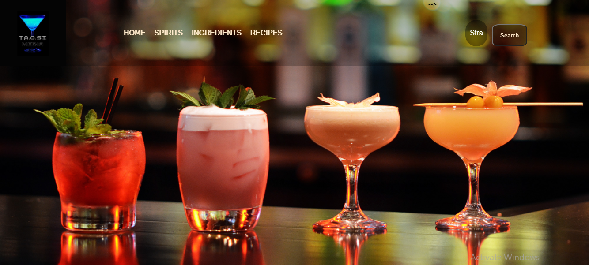
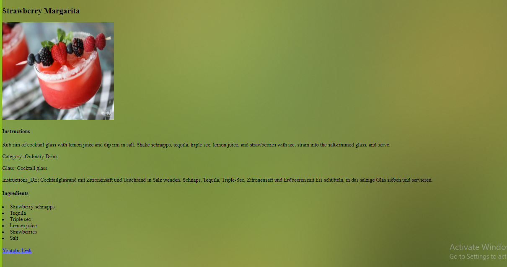

# Masai-Sprint-3
<h1>JS API Project<h1>
<h4>This page shows a basic website related to Cocktails - Margarita.

• It has a search input & a button which takes the drink name, fetches the details from the link with API, matches with the input and displays the result in next page. 

• Search: It searches the given cocktail name & takes the user to respective html file. 

• On the next page, it displays the respective Margarita cocktail image, category, ingredients, recipe instructions and the youtube link.<h4>
   

   

